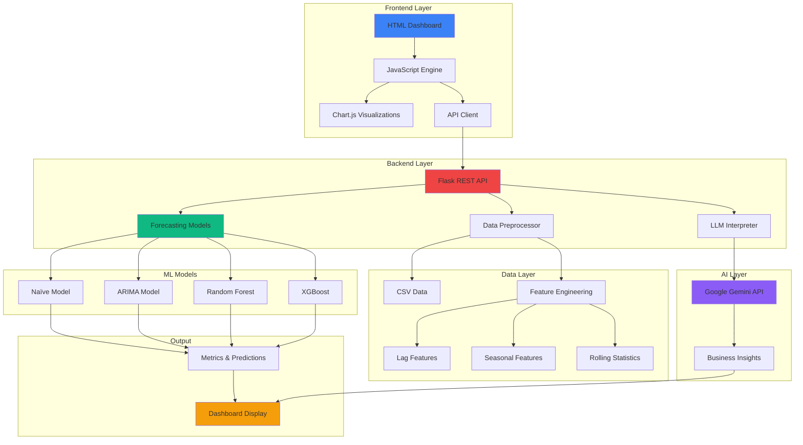
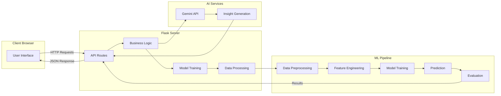
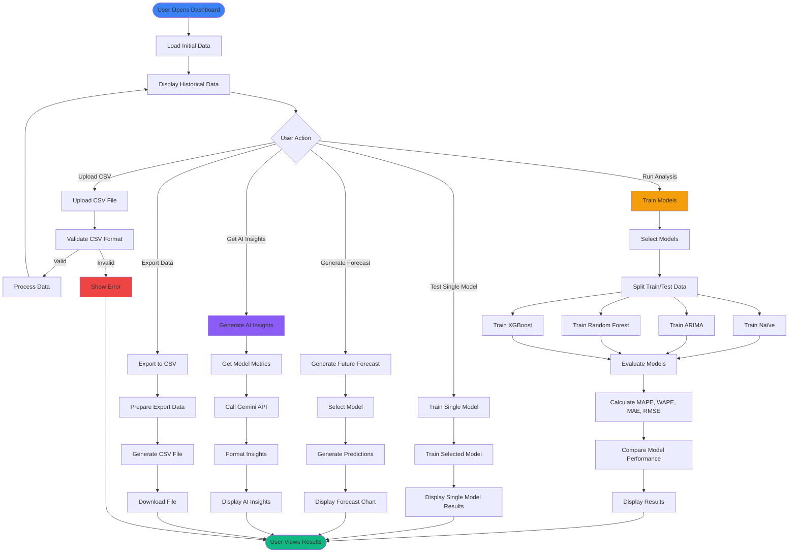

# 🚀 Enterprise Forecasting Platform

<div align="center">


**Advanced Sales Forecasting & Analytics Platform**  
*Enterprise-grade time series forecasting powered by Machine Learning and AI*

[Features](#-features) • [Quick Start](#-quick-start) • [Architecture](#-architecture) • [Documentation](#-documentation) • [Demo](#-demo)

</div>

---

## 📋 Table of Contents

- [Overview](#-overview)
- [Features](#-features)
- [Architecture](#-architecture)
- [System Flow](#-system-flow)
- [Quick Start](#-quick-start)
- [Installation](#-installation)
- [Usage Guide](#-usage-guide)
- [API Documentation](#-api-documentation)
- [Model Details](#-model-details)
- [Dashboard Features](#-dashboard-features)
- [Screenshots](#-screenshots)
- [Contributing](#-contributing)
- [License](#-license)

---

## 🎯 Overview

The **Enterprise Forecasting Platform** is a comprehensive, production-ready solution for time series sales forecasting. It combines multiple machine learning models with AI-powered insights to deliver accurate predictions and actionable business intelligence.

### Key Highlights

- 🎯 **Multi-Model Ensemble**: Naïve, ARIMA, Random Forest, and XGBoost
- 🤖 **AI-Powered Insights**: Google Gemini 2.5 Flash integration for intelligent analysis
- 📊 **Corporate Dashboard**: Professional, interactive HTML/CSS/JS interface
- 📈 **Advanced Analytics**: Seasonality detection, feature importance, trend analysis
- 🔄 **Real-Time Processing**: Dynamic model training and forecasting
- 📥 **Data Import/Export**: CSV upload and export functionality
- 🎨 **Enterprise UI/UX**: Modern, responsive, and intuitive design

---

## ✨ Features

### 🧠 Machine Learning Models

| Model | Type | Best For | Accuracy |
|-------|------|----------|----------|
| **Naïve** | Baseline | Simple patterns | Fast, baseline |
| **ARIMA** | Statistical | Time series trends | Excellent for trends |
| **Random Forest** | Ensemble ML | Complex patterns | High accuracy |
| **XGBoost** | Gradient Boosting | Non-linear patterns | Best overall |

### 📊 Dashboard Capabilities

- ✅ **Comprehensive Analysis**: Train and compare all models simultaneously
- ✅ **Individual Model Testing**: Test each model with custom parameters
- ✅ **Threshold Filtering**: Filter models based on MAPE/WAPE thresholds
- ✅ **Future Forecasting**: Generate predictions for next N months
- ✅ **AI Insights**: Get intelligent business recommendations
- ✅ **Advanced Analytics**: Deep-dive diagnostics and metrics
- ✅ **Data Export**: Export results to CSV format

### 🎨 User Interface

- 🌙 **Dark Theme**: Professional corporate aesthetic
- 📱 **Responsive Design**: Works on all screen sizes
- 🎭 **Glassmorphism**: Modern UI effects
- ⚡ **Real-Time Updates**: Live status and progress indicators
- 🔔 **Toast Notifications**: User-friendly feedback system

---

## 🏗️ Architecture

### System Architecture Diagram



### Component Architecture



---

## 🔄 System Flow

### Complete Workflow Diagram



### Data Processing Pipeline


---

## 🚀 Quick Start

### Prerequisites

- Python 3.8 or higher
- pip (Python package manager)
- Git

### Installation

1. **Clone the repository**
   ```bash
   git clone https://github.com/sumith1309/Enterprise-Forecasting.git
   cd Enterprise-Forecasting
   ```

2. **Create virtual environment**
   ```bash
   # Windows
   python -m venv venv
   venv\Scripts\activate
   
   # Linux/Mac
   python3 -m venv venv
   source venv/bin/activate
   ```

3. **Install dependencies**
   ```bash
   pip install -r requirements.txt
   ```

4. **Run the application**
   ```bash
   # Windows
   python backend/app.py
   
   # Linux/Mac
   python3 backend/app.py
   ```

5. **Open your browser**
   ```
   Navigate to: http://localhost:5000
   ```

### Quick Setup Scripts

**Windows:**
```bash
setup_and_run.bat
```

**Linux/Mac:**
```bash
chmod +x setup_and_run.sh
./setup_and_run.sh
```

---

## 📖 Usage Guide

### 1. Loading Data

The dashboard automatically loads default sample data. To use your own data:

1. Click **"Upload Data"** button in the header
2. Select or drag & drop your CSV file
3. Ensure your CSV has `Month` and `Sales` columns
4. Click **"Upload"**

**CSV Format:**
```csv
Month,Sales
2023-01-01,15000
2023-02-01,18000
2023-03-01,22000
...
```

### 2. Running Comprehensive Analysis

1. Go to **"Overview"** tab
2. Select models to train (checkboxes)
3. Adjust test size slider (default: 3 months)
4. Click **"Run Comprehensive Analysis"**
5. Wait for training to complete (~10-15 seconds)
6. View results:
   - Model comparison metrics
   - Performance charts
   - Best model identification

### 3. Individual Model Testing

1. Go to **"Model Lab"** tab
2. Select a model (Naïve, ARIMA, Random Forest, or XGBoost)
3. Adjust model-specific parameters
4. Click **"Train [Model Name]"**
5. View individual results and charts

### 4. Generating Forecasts

1. Go to **"Future Forecast"** tab
2. Select forecast horizon (default: 3 months)
3. Choose model (or use "Best Model")
4. Click **"Generate Forecast"**
5. View forecast chart with confidence intervals

### 5. AI-Powered Insights

1. Go to **"AI Insights"** tab
2. Click **"Generate Insights"**
3. View comprehensive analysis:
   - Model performance interpretation
   - Seasonality and trend analysis
   - Business recommendations
   - Action plans

### 6. Advanced Analytics

1. Go to **"Advanced Analytics & Diagnostics"** tab
2. View:
   - Seasonal decomposition chart
   - Feature importance (from best ML model)
   - Trend strength
   - Seasonality detection
   - Best feature identification
   - Model consensus

### 7. Exporting Results

1. After running analysis, click **"Export"** button in header
2. CSV file downloads automatically with:
   - Model performance metrics
   - Data summary
   - Predictions from all models
   - Timestamped filename

---

## 🔌 API Documentation

### Base URL
```
http://localhost:5000/api
```

### Endpoints

#### 1. Load Data
```http
GET /api/load-data
```
Returns: Historical data statistics and features

#### 2. Upload CSV
```http
POST /api/upload-csv
Content-Type: multipart/form-data

Body: file (CSV file)
```
Returns: Success status and data preview

#### 3. Train Models
```http
POST /api/train-models
Content-Type: application/json

Body: {
  "models": ["Naive", "ARIMA", "Random_Forest", "XGBoost"],
  "test_size": 3
}
```
Returns: Training results, metrics, and predictions

#### 4. Train Single Model
```http
POST /api/train-single-model
Content-Type: application/json

Body: {
  "model": "Random_Forest",
  "test_size": 3,
  "parameters": {}
}
```
Returns: Single model results and metrics

#### 5. Generate Forecast
```http
POST /api/generate-forecast
Content-Type: application/json

Body: {
  "model_name": "best",
  "n_months": 3
}
```
Returns: Forecast dates and values

#### 6. AI Insights
```http
POST /api/ai-insights
Content-Type: application/json
```
Returns: AI-generated insights and recommendations

#### 7. Seasonality Analysis
```http
GET /api/seasonality-analysis
```
Returns: Seasonal patterns and strength

#### 8. Feature Importance
```http
GET /api/feature-importance
```
Returns: Feature importance from best ML model

#### 9. Advanced Analytics
```http
GET /api/advanced-analytics
```
Returns: Trend strength, seasonality, best feature, model consensus

#### 10. Export Data
```http
GET /api/export-data
```
Returns: CSV file download

---

## 🤖 Model Details

### 1. Naïve Model
- **Type**: Baseline
- **Method**: Uses last observed value
- **Use Case**: Simple baseline comparison
- **Pros**: Fast, interpretable
- **Cons**: No trend/seasonality capture

### 2. ARIMA Model
- **Type**: Statistical (AutoRegressive Integrated Moving Average)
- **Parameters**: (p, d, q) order
- **Use Case**: Time series with trends
- **Pros**: Handles trends well
- **Cons**: Requires parameter tuning

### 3. Random Forest
- **Type**: Ensemble Machine Learning
- **Parameters**: 
  - `n_estimators`: Number of trees (default: 100)
  - `max_depth`: Maximum tree depth (default: 10)
- **Use Case**: Complex non-linear patterns
- **Pros**: High accuracy, feature importance
- **Cons**: Can overfit with small datasets

### 4. XGBoost
- **Type**: Gradient Boosting
- **Parameters**:
  - `n_estimators`: Boosting rounds (default: 100)
  - `learning_rate`: Step size (default: 0.1)
  - `max_depth`: Tree depth (default: 5)
- **Use Case**: Best overall performance
- **Pros**: Highest accuracy, handles non-linearity
- **Cons**: More complex, longer training time

### Performance Metrics

| Metric | Description | Best Value |
|--------|-------------|------------|
| **MAPE** | Mean Absolute Percentage Error | Lower is better |
| **WAPE** | Weighted Absolute Percentage Error | Lower is better |
| **MAE** | Mean Absolute Error | Lower is better |
| **RMSE** | Root Mean Squared Error | Lower is better |
| **R² Score** | Coefficient of Determination | Higher is better (max: 1.0) |

---

## 📊 Dashboard Features

### Overview Tab
- Model comparison metrics
- Combined actual vs predicted chart
- Detailed metrics table
- Best model identification

### Data Exploration Tab
- Historical sales visualization
- Data statistics
- Feature overview (lag, seasonal, rolling)

### Model Lab Tab
- Individual model testing
- Custom parameter configuration
- Single model results and charts

### Model Comparison Tab
- Threshold-based filtering
- MAPE/WAPE threshold sliders
- Passing/failing model display

### Future Forecast Tab
- Forecast generation
- Scenario analysis (best, base, worst case)
- Forecast horizon selection

### AI Insights Tab
- Gemini AI-powered analysis
- Business recommendations
- Action plans
- Formatted insights display

### Advanced Analytics Tab
- Seasonal decomposition
- Feature importance chart
- Trend strength analysis
- Seasonality detection
- Model consensus metrics

---

## 📸 Screenshots

### Dashboard Overview
```
┌─────────────────────────────────────────────────────────┐
│  Enterprise Forecasting - Corporate Analytics Platform │
│  [Upload Data] [Export] [Search...] [User Menu]        │
├─────────────────────────────────────────────────────────┤
│                                                          │
│  📊 Overview │ 📈 Data │ 🧪 Model Lab │ ⚖️ Comparison │
│  🔮 Forecast │ 🧠 AI Insights │ 📉 Advanced Analytics  │
│                                                          │
│  ┌──────────────────────────────────────────────────┐  │
│  │  Hero Section:                                    │  │
│  │  • Average Sales: $XX,XXX                         │  │
│  │  • Growth Rate: X.X%                              │  │
│  │  • Data Period: Jan 2023 - Dec 2023              │  │
│  └──────────────────────────────────────────────────┘  │
│                                                          │
│  ┌──────────────────────────────────────────────────┐  │
│  │  Model Performance Chart                          │  │
│  │  [Interactive Chart.js Visualization]            │  │
│  └──────────────────────────────────────────────────┘  │
│                                                          │
└─────────────────────────────────────────────────────────┘
```

---

## 🛠️ Technical Stack

### Backend
- **Framework**: Flask 2.0+
- **Language**: Python 3.8+
- **ML Libraries**: 
  - scikit-learn
  - XGBoost
  - statsmodels (ARIMA)
  - pandas, numpy

### Frontend
- **HTML5**: Semantic markup
- **CSS3**: Modern styling with CSS Grid/Flexbox
- **JavaScript**: ES6+ features
- **Chart.js**: Interactive visualizations
- **Font Awesome**: Icons

### AI Integration
- **Google Gemini 2.5 Flash**: AI-powered insights
- **API**: RESTful integration

### Development Tools
- **Git**: Version control
- **Virtual Environment**: Python venv
- **Package Manager**: pip

---

## 📁 Project Structure

```
Enterprise-Forecasting/
│
├── backend/
│   └── app.py                 # Flask backend server
│
├── frontend/
│   ├── index.html            # Main dashboard HTML
│   ├── styles.css            # Styling
│   └── main.js               # JavaScript logic
│
├── src/
│   ├── data_preprocessing.py  # Data loading & preprocessing
│   ├── forecasting_models.py # ML model implementations
│   ├── llm_interpreter.py    # Gemini AI integration
│   └── visualizations.py     # Chart generation
│
├── data/
│   └── monthly_sales.csv     # Sample data
│
├── requirements.txt          # Python dependencies
├── .gitignore               # Git ignore rules
├── README.md                # This file
│
└── setup_and_run.bat/sh     # Quick setup scripts
```

---

## 🔧 Configuration

### Environment Variables

Create a `.env` file (optional):
```env
GEMINI_API_KEY=your_api_key_here
FLASK_PORT=5000
DEBUG=True
```

### Model Parameters

Edit model parameters in:
- **Individual Training**: Model Lab tab → Adjust sliders
- **Default Parameters**: `src/forecasting_models.py`

---

## 🐛 Troubleshooting

### Common Issues

1. **Port 5000 already in use**
   ```bash
   # Change port in backend/app.py
   app.run(debug=True, port=5001)
   ```

2. **CSV upload fails**
   - Ensure CSV has `Month` and `Sales` columns
   - Check date format (YYYY-MM-DD)
   - Verify no missing values

3. **Models not training**
   - Ensure data is loaded first
   - Check console for error messages
   - Verify all dependencies installed

4. **Gemini API errors**
   - Check API key is valid
   - Verify internet connection
   - Check API quota limits

---

## 🤝 Contributing

Contributions are welcome! Please follow these steps:

1. Fork the repository
2. Create a feature branch (`git checkout -b feature/AmazingFeature`)
3. Commit your changes (`git commit -m 'Add some AmazingFeature'`)
4. Push to the branch (`git push origin feature/AmazingFeature`)
5. Open a Pull Request

### Development Guidelines

- Follow PEP 8 Python style guide
- Add comments for complex logic
- Update documentation for new features
- Test thoroughly before submitting PR

---

## 📝 License

This project is licensed under the MIT License - see the LICENSE file for details.

---

## 👥 Authors

- **Sumith** - *Initial work* - [sumith1309](https://github.com/sumith1309)

---

## 🙏 Acknowledgments

- Google Gemini API for AI insights
- Chart.js for beautiful visualizations
- Flask community for excellent framework
- scikit-learn and XGBoost teams for ML libraries

---

## 📞 Support

For issues, questions, or contributions:
- Open an issue on GitHub
- Check existing documentation
- Review code comments

---

## 🎯 Roadmap

- [ ] Add more forecasting models (Prophet, LSTM)
- [ ] Real-time data streaming
- [ ] Multi-variate forecasting
- [ ] Automated hyperparameter tuning
- [ ] Model versioning and A/B testing
- [ ] REST API authentication
- [ ] Docker containerization
- [ ] Cloud deployment guides

---

<div align="center">

**Made with ❤️ for Enterprise Forecasting**

⭐ Star this repo if you find it helpful!

[⬆ Back to Top](#-enterprise-forecasting-platform)

</div>
