# 🚀 Enterprise Forecasting Platform

<div align="center">


**Advanced Sales Forecasting & Analytics Platform**  
*Enterprise-grade time series forecasting powered by Machine Learning and AI*

[Features](#-features) • [Quick Start](#-quick-start) • [Architecture](#-architecture) • [Documentation](#-documentation) • [Demo](#-demo)

</div>

---

## 📋 Table of Contents

- [Overview](#-overview)
- [Features](#-features)
- [Architecture](#-architecture)
- [System Flow](#-system-flow)
- [Quick Start](#-quick-start)
- [Installation](#-installation)
- [Usage Guide](#-usage-guide)
  - [Synthetic Sales Data Generator](#15-synthetic-sales-data-generator)
- [API Documentation](#-api-documentation)
- [Model Details](#-model-details)
- [Dashboard Features](#-dashboard-features)
- [Screenshots](#-screenshots)
- [Contributing](#-contributing)
- [License](#-license)

---

## 🎯 Overview

The **Enterprise Forecasting Platform** is a comprehensive, production-ready solution for time series sales forecasting. It combines multiple machine learning models with AI-powered insights to deliver accurate predictions and actionable business intelligence.

### Key Highlights

- 🎯 **Multi-Model Ensemble**: Naïve, ARIMA, Random Forest, and XGBoost
- 🤖 **AI-Powered Insights**: Google Gemini 2.5 Flash integration for intelligent analysis
- 📊 **Corporate Dashboard**: Professional, interactive HTML/CSS/JS interface
- 📈 **Advanced Analytics**: Seasonality detection, feature importance, trend analysis
- 🔄 **Real-Time Processing**: Dynamic model training and forecasting
- 📥 **Data Import/Export**: CSV upload and export functionality
- 🛒 **Synthetic Data Generator**: Built-in tool to generate test datasets with customizable parameters
- 🎨 **Enterprise UI/UX**: Modern, responsive, and intuitive design

---

## ✨ Features

### 🧠 Machine Learning Models

| Model | Type | Best For | Accuracy |
|-------|------|----------|----------|
| **Naïve** | Baseline | Simple patterns | Fast, baseline |
| **ARIMA** | Statistical | Time series trends | Excellent for trends |
| **Random Forest** | Ensemble ML | Complex patterns | High accuracy |
| **XGBoost** | Gradient Boosting | Non-linear patterns | Best overall |

### 📊 Dashboard Capabilities

- ✅ **Comprehensive Analysis**: Train and compare all models simultaneously
- ✅ **Individual Model Testing**: Test each model with custom parameters
- ✅ **Threshold Filtering**: Filter models based on MAPE/WAPE thresholds
- ✅ **Future Forecasting**: Generate predictions for next N months
- ✅ **AI Insights**: Get intelligent business recommendations
- ✅ **Advanced Analytics**: Deep-dive diagnostics and metrics
- ✅ **Data Export**: Export results to CSV format

### 🎨 User Interface

- 🌙 **Dark Theme**: Professional corporate aesthetic
- 📱 **Responsive Design**: Works on all screen sizes
- 🎭 **Glassmorphism**: Modern UI effects
- ⚡ **Real-Time Updates**: Live status and progress indicators
- 🔔 **Toast Notifications**: User-friendly feedback system

---

## 🏗️ Architecture

### System Architecture Diagram

```mermaid
graph TB
    subgraph "Frontend Layer"
        A[HTML Dashboard] --> B[JavaScript Engine]
        B --> C[Chart.js Visualizations]
        B --> D[API Client]
    end
    
    subgraph "Backend Layer"
        D --> E[Flask REST API]
        E --> F[Data Preprocessor]
        E --> G[Forecasting Models]
        E --> H[LLM Interpreter]
    end
    
    subgraph "Data Layer"
        F --> I[CSV Data]
        F --> J[Feature Engineering]
        J --> K[Lag Features]
        J --> L[Seasonal Features]
        J --> M[Rolling Statistics]
    end
    
    subgraph "ML Models"
        G --> N[Naïve Model]
        G --> O[ARIMA Model]
        G --> P[Random Forest]
        G --> Q[XGBoost]
    end
    
    subgraph "AI Layer"
        H --> R[Google Gemini API]
        R --> S[Business Insights]
    end
    
    subgraph "Output"
        N --> T[Metrics & Predictions]
        O --> T
        P --> T
        Q --> T
        T --> U[Dashboard Display]
        S --> U
    end
    
    style A fill:#3B82F6
    style E fill:#EF4444
    style G fill:#10B981
    style R fill:#8B5CF6
    style U fill:#F59E0B
```



### Component Architecture


---

## 🔄 System Flow

### Complete Workflow Diagram

```mermaid
flowchart TD
    Start([User Opens Dashboard]) --> LoadData[Load Initial Data]
    LoadData --> DisplayData[Display Historical Data]
    DisplayData --> UserAction{User Action}
    
    UserAction -->|Upload CSV| Upload[Upload CSV File]
    UserAction -->|Run Analysis| Train[Train Models]
    UserAction -->|Test Single Model| SingleTrain[Train Single Model]
    UserAction -->|Generate Forecast| Forecast[Generate Future Forecast]
    UserAction -->|Get AI Insights| AIInsights[Generate AI Insights]
    UserAction -->|Export Data| Export[Export to CSV]
    
    Upload --> Validate[Validate CSV Format]
    Validate -->|Valid| ProcessData[Process Data]
    Validate -->|Invalid| Error[Show Error]
    ProcessData --> DisplayData
    
    Train --> SelectModels[Select Models]
    SelectModels --> SplitData[Split Train/Test Data]
    SplitData --> TrainNaive[Train Naïve]
    SplitData --> TrainARIMA[Train ARIMA]
    SplitData --> TrainRF[Train Random Forest]
    SplitData --> TrainXGB[Train XGBoost]
    
    TrainNaive --> Evaluate[Evaluate Models]
    TrainARIMA --> Evaluate
    TrainRF --> Evaluate
    TrainXGB --> Evaluate
    
    Evaluate --> CalculateMetrics[Calculate MAPE, WAPE, MAE, RMSE]
    CalculateMetrics --> CompareModels[Compare Model Performance]
    CompareModels --> DisplayResults[Display Results]
    
    SingleTrain --> TrainSingle[Train Selected Model]
    TrainSingle --> DisplaySingle[Display Single Model Results]
    
    Forecast --> SelectModel[Select Model]
    SelectModel --> GeneratePred[Generate Predictions]
    GeneratePred --> DisplayForecast[Display Forecast Chart]
    
    AIInsights --> GetMetrics[Get Model Metrics]
    GetMetrics --> CallGemini[Call Gemini API]
    CallGemini --> FormatInsights[Format Insights]
    FormatInsights --> DisplayAI[Display AI Insights]
    
    Export --> PrepareData[Prepare Export Data]
    PrepareData --> GenerateCSV[Generate CSV File]
    GenerateCSV --> Download[Download File]
    
    DisplayResults --> End([User Views Results])
    DisplaySingle --> End
    DisplayForecast --> End
    DisplayAI --> End
    Download --> End
    Error --> End
    
    style Start fill:#3B82F6
    style End fill:#10B981
    style Error fill:#EF4444
    style Train fill:#F59E0B
    style AIInsights fill:#8B5CF6
```



### Data Processing Pipeline


---

## 🚀 Quick Start

### Prerequisites

- Python 3.8 or higher
- pip (Python package manager)
- Git

### Installation

1. **Clone the repository**
   ```bash
   git clone https://github.com/sumith1309/Enterprise-Forecasting.git
   cd Enterprise-Forecasting
   ```

2. **Create virtual environment**
   ```bash
   # Windows
   python -m venv venv
   venv\Scripts\activate
   
   # Linux/Mac
   python3 -m venv venv
   source venv/bin/activate
   ```

3. **Install dependencies**
   ```bash
   pip install -r requirements.txt
   ```

4. **Run the application**
   ```bash
   # Windows
   python backend/app.py
   
   # Linux/Mac
   python3 backend/app.py
   ```

5. **Open your browser**
   ```
   Navigate to: http://localhost:5000
   ```

### Quick Setup Scripts

**Windows:**
```bash
setup_and_run.bat
```

**Linux/Mac:**
```bash
chmod +x setup_and_run.sh
./setup_and_run.sh
```

---

## 📖 Usage Guide

### 1. Loading Data

The dashboard automatically loads default sample data. To use your own data:

1. Click **"Upload Data"** button in the header
2. Select or drag & drop your CSV file
3. Ensure your CSV has `Month` and `Sales` columns
4. Click **"Upload"**

**CSV Format:**
```csv
Month,Sales
2023-01-01,15000
2023-02-01,18000
2023-03-01,22000
...
```

### 1.5. Synthetic Sales Data Generator

Need test data? Use our built-in **Advanced Sales Forecasting Data Generator** to create synthetic datasets with customizable parameters:

**Features:**
- 📅 **Custom Date Range**: Select start and end years
- 💰 **Base Sales**: Set initial sales amount
- 📈 **Trend Control**: Adjust annual growth percentage
- 🎯 **Seasonality**: Choose Low, Medium, or High seasonality strength
- 🔧 **Optional Columns**: Add Temperature, Marketing Spend, Holiday indicators
- 📊 **Live Preview**: See generated data before downloading
- 📥 **CSV Export**: Download ready-to-use CSV files

**How to Use:**

1. Copy the HTML code below and save it as `data_generator.html`
2. Open it in your web browser
3. Adjust parameters:
   - **Start/End Year**: Date range for your dataset
   - **Base Sales**: Starting sales amount
   - **Annual Growth**: Year-over-year growth percentage
   - **Seasonality Strength**: How pronounced seasonal patterns are
   - **Optional Columns**: Additional features (Temperature, Marketing, Holiday)
4. Click **"Generate Data"** to preview
5. Click **"Download CSV"** to save the file
6. Upload the CSV to the dashboard using the "Upload Data" button

**Data Generator HTML:**

```html
<!DOCTYPE html>
<html lang="en">
<head>
    <meta charset="UTF-8">
    <meta name="viewport" content="width=device-width, initial-scale=1.0">
    <title>Synthetic Sales Data Generator</title>
    <style>
        body {
            font-family: Arial, sans-serif;
            max-width: 1200px;
            margin: 0 auto;
            padding: 20px;
            background-color: #f5f5f5;
        }
        .container {
            background: white;
            padding: 30px;
            border-radius: 10px;
            box-shadow: 0 2px 10px rgba(0,0,0,0.1);
        }
        h1 {
            color: #333;
            text-align: center;
        }
        .controls {
            display: grid;
            grid-template-columns: repeat(auto-fit, minmax(200px, 1fr));
            gap: 15px;
            margin-bottom: 30px;
        }
        .control-group {
            display: flex;
            flex-direction: column;
        }
        label {
            font-weight: bold;
            margin-bottom: 5px;
            color: #555;
        }
        input, select {
            padding: 8px;
            border: 1px solid #ddd;
            border-radius: 5px;
            font-size: 14px;
        }
        button {
            background-color: #4CAF50;
            color: white;
            padding: 12px 24px;
            border: none;
            border-radius: 5px;
            cursor: pointer;
            font-size: 16px;
            margin: 10px;
            transition: background-color 0.3s;
        }
        button:hover {
            background-color: #45a049;
        }
        #downloadBtn {
            background-color: #2196F3;
        }
        #downloadBtn:hover {
            background-color: #0b7dda;
        }
        .preview {
            margin-top: 30px;
            overflow-x: auto;
        }
        table {
            width: 100%;
            border-collapse: collapse;
        }
        th, td {
            border: 1px solid #ddd;
            padding: 8px;
            text-align: left;
        }
        th {
            background-color: #4CAF50;
            color: white;
        }
        tr:nth-child(even) {
            background-color: #f2f2f2;
        }
        .stats {
            margin-top: 20px;
            padding: 15px;
            background-color: #e8f5e9;
            border-radius: 5px;
        }
        .button-container {
            text-align: center;
            margin-top: 20px;
        }
    </style>
</head>
<body>
    <div class="container">
        <h1>🛒 Advanced Sales Forecasting Data Generator</h1>
        
        <div class="controls">
            <div class="control-group">
                <label for="startYear">Start Year:</label>
                <input type="number" id="startYear" value="2020" min="2000" max="2024">
            </div>
            
            <div class="control-group">
                <label for="endYear">End Year:</label>
                <input type="number" id="endYear" value="2024" min="2000" max="2024">
            </div>
            
            <div class="control-group">
                <label for="baseSales">Base Sales ($):</label>
                <input type="number" id="baseSales" value="100000" min="1000">
            </div>
            
            <div class="control-group">
                <label for="trend">Annual Growth (%):</label>
                <input type="number" id="trend" value="5" min="-50" max="100">
            </div>
            
            <div class="control-group">
                <label for="seasonality">Seasonality Strength:</label>
                <select id="seasonality">
                    <option value="low">Low</option>
                    <option value="medium" selected>Medium</option>
                    <option value="high">High</option>
                </select>
            </div>
            
            <div class="control-group">
                <label for="includeOptional">Include Optional Columns:</label>
                <select id="includeOptional">
                    <option value="all" selected>All (Temperature, Marketing, Holiday)</option>
                    <option value="temp">Temperature Only</option>
                    <option value="marketing">Marketing Only</option>
                    <option value="holiday">Holiday Only</option>
                    <option value="none">None</option>
                </select>
            </div>
        </div>
        
        <div class="button-container">
            <button onclick="generateData()">Generate Data</button>
            <button id="downloadBtn" onclick="downloadCSV()" style="display:none;">Download CSV</button>
        </div>
        
        <div id="stats" class="stats" style="display:none;"></div>
        
        <div class="preview" id="preview"></div>
    </div>
    <script>
        let generatedData = [];
        function generateData() {
            const startYear = parseInt(document.getElementById('startYear').value);
            const endYear = parseInt(document.getElementById('endYear').value);
            const baseSales = parseFloat(document.getElementById('baseSales').value);
            const annualGrowth = parseFloat(document.getElementById('trend').value) / 100;
            const seasonality = document.getElementById('seasonality').value;
            const includeOptional = document.getElementById('includeOptional').value;
            
            generatedData = [];
            
            // Seasonality factors
            const seasonFactors = {
                low: [1.0, 1.0, 1.0, 1.0, 1.0, 1.0, 1.0, 1.0, 1.0, 1.0, 1.0, 1.1],
                medium: [0.8, 0.9, 1.0, 1.1, 1.2, 1.3, 1.2, 1.1, 1.0, 0.9, 0.8, 1.4],
                high: [0.6, 0.7, 0.9, 1.1, 1.3, 1.5, 1.4, 1.2, 1.0, 0.8, 0.7, 1.8]
            };
            
            const monthlyFactors = seasonFactors[seasonality];
            
            for (let year = startYear; year <= endYear; year++) {
                for (let month = 1; month <= 12; month++) {
                    const yearsSinceStart = year - startYear;
                    const monthStr = month.toString().padStart(2, '0');
                    const dateStr = `${year}-${monthStr}`;
                    
                    // Calculate sales with trend and seasonality
                    const trendFactor = Math.pow(1 + annualGrowth, yearsSinceStart);
                    const seasonalFactor = monthlyFactors[month - 1];
                    const randomNoise = 0.9 + Math.random() * 0.2; // ±10% random variation
                    
                    let sales = baseSales * trendFactor * seasonalFactor * randomNoise;
                    
                    const row = {
                        Month: dateStr,
                        Sales: Math.round(sales)
                    };
                    
                    // Add optional columns based on selection
                    if (includeOptional === 'all' || includeOptional === 'temp') {
                        // Temperature varies by month (seasonal pattern)
                        const baseTemp = [30, 35, 45, 55, 65, 75, 80, 78, 70, 58, 45, 35][month - 1];
                        row.Temperature = baseTemp + (Math.random() - 0.5) * 10;
                        row.Temperature = Math.round(row.Temperature * 10) / 10;
                    }
                    
                    if (includeOptional === 'all' || includeOptional === 'marketing') {
                        // Marketing spend correlates with expected sales
                        const marketingBase = sales * 0.05; // 5% of sales
                        const marketingVariation = 0.8 + Math.random() * 0.4; // ±20% variation
                        row.Marketing_Spend = Math.round(marketingBase * marketingVariation);
                    }
                    
                    if (includeOptional === 'all' || includeOptional === 'holiday') {
                        // Holiday season indicator (November, December, and special months)
                        row.Holiday_Season = (month === 11 || month === 12 || month === 2 || month === 7) ? 1 : 0;
                    }
                    
                    // Adjust sales based on optional factors
                    if (row.Temperature !== undefined) {
                        // Higher temperature slightly increases sales (ice cream effect)
                        sales *= (1 + (row.Temperature - 55) * 0.001);
                    }
                    
                    if (row.Marketing_Spend !== undefined) {
                        // Marketing spend increases sales
                        sales *= (1 + row.Marketing_Spend / (baseSales * 0.5));
                    }
                    
                    if (row.Holiday_Season !== undefined && row.Holiday_Season === 1) {
                        // Holiday season boost
                        sales *= 1.2;
                    }
                    
                    row.Sales = Math.round(sales);
                    generatedData.push(row);
                }
            }
            
            displayPreview();
            displayStats();
            document.getElementById('downloadBtn').style.display = 'inline-block';
        }
        
        function displayPreview() {
            const preview = document.getElementById('preview');
            const maxRows = 20;
            
            let html = '<h3>Data Preview (first 20 rows)</h3>';
            html += '<table>';
            
            // Header
            const columns = Object.keys(generatedData[0]);
            html += '<tr>';
            columns.forEach(col => {
                html += `<th>${col}</th>`;
            });
            html += '</tr>';
            
            // Data rows
            for (let i = 0; i < Math.min(maxRows, generatedData.length); i++) {
                html += '<tr>';
                columns.forEach(col => {
                    let value = generatedData[i][col];
                    if (col === 'Sales' || col === 'Marketing_Spend') {
                        value = '$' + value.toLocaleString();
                    } else if (col === 'Temperature') {
                        value = value + '°F';
                    }
                    html += `<td>${value}</td>`;
                });
                html += '</tr>';
            }
            
            html += '</table>';
            
            if (generatedData.length > maxRows) {
                html += `<p style="text-align: center; color: #666;">... and ${generatedData.length - maxRows} more rows</p>`;
            }
            
            preview.innerHTML = html;
        }
        
        function displayStats() {
            const stats = document.getElementById('stats');
            const salesValues = generatedData.map(row => row.Sales);
            const totalSales = salesValues.reduce((a, b) => a + b, 0);
            const avgSales = totalSales / salesValues.length;
            const maxSales = Math.max(...salesValues);
            const minSales = Math.min(...salesValues);
            
            let statsHTML = '<h3>📊 Dataset Statistics</h3>';
            statsHTML += `<p><strong>Total Rows:</strong> ${generatedData.length}</p>`;
            statsHTML += `<p><strong>Date Range:</strong> ${generatedData[0].Month} to ${generatedData[generatedData.length - 1].Month}</p>`;
            statsHTML += `<p><strong>Total Sales:</strong> $${totalSales.toLocaleString()}</p>`;
            statsHTML += `<p><strong>Average Monthly Sales:</strong> $${Math.round(avgSales).toLocaleString()}</p>`;
            statsHTML += `<p><strong>Max Monthly Sales:</strong> $${maxSales.toLocaleString()}</p>`;
            statsHTML += `<p><strong>Min Monthly Sales:</strong> $${minSales.toLocaleString()}</p>`;
            
            const columns = Object.keys(generatedData[0]);
            statsHTML += `<p><strong>Columns:</strong> ${columns.join(', ')}</p>`;
            
            stats.innerHTML = statsHTML;
            stats.style.display = 'block';
        }
        
        function downloadCSV() {
            if (generatedData.length === 0) {
                alert('Please generate data first!');
                return;
            }
            
            // Convert to CSV
            const columns = Object.keys(generatedData[0]);
            let csv = columns.join(',') + '\n';
            
            generatedData.forEach(row => {
                const values = columns.map(col => row[col]);
                csv += values.join(',') + '\n';
            });
            
            // Create download link
            const blob = new Blob([csv], { type: 'text/csv;charset=utf-8;' });
            const link = document.createElement('a');
            const url = URL.createObjectURL(blob);
            
            link.setAttribute('href', url);
            link.setAttribute('download', 'synthetic_sales_data.csv');
            link.style.display = 'none';
            
            document.body.appendChild(link);
            link.click();
            document.body.removeChild(link);
        }
        
        // Generate initial data on page load
        window.onload = function() {
            generateData();
        };
    </script>
</body>
</html>
```

**Tips for Testing:**
- Use **Low seasonality** for stable businesses (utilities, subscriptions)
- Use **Medium seasonality** for retail, e-commerce
- Use **High seasonality** for seasonal products (ice cream, holiday items)
- Test with different **growth rates** to see how models handle trends
- Generate datasets with **optional columns** to test feature engineering

### 2. Running Comprehensive Analysis

1. Go to **"Overview"** tab
2. Select models to train (checkboxes)
3. Adjust test size slider (default: 3 months)
4. Click **"Run Comprehensive Analysis"**
5. Wait for training to complete (~10-15 seconds)
6. View results:
   - Model comparison metrics
   - Performance charts
   - Best model identification

### 3. Individual Model Testing

1. Go to **"Model Lab"** tab
2. Select a model (Naïve, ARIMA, Random Forest, or XGBoost)
3. Adjust model-specific parameters
4. Click **"Train [Model Name]"**
5. View individual results and charts

### 4. Generating Forecasts

1. Go to **"Future Forecast"** tab
2. Select forecast horizon (default: 3 months)
3. Choose model (or use "Best Model")
4. Click **"Generate Forecast"**
5. View forecast chart with confidence intervals

### 5. AI-Powered Insights

1. Go to **"AI Insights"** tab
2. Click **"Generate Insights"**
3. View comprehensive analysis:
   - Model performance interpretation
   - Seasonality and trend analysis
   - Business recommendations
   - Action plans

### 6. Advanced Analytics

1. Go to **"Advanced Analytics & Diagnostics"** tab
2. View:
   - Seasonal decomposition chart
   - Feature importance (from best ML model)
   - Trend strength
   - Seasonality detection
   - Best feature identification
   - Model consensus

### 7. Exporting Results

1. After running analysis, click **"Export"** button in header
2. CSV file downloads automatically with:
   - Model performance metrics
   - Data summary
   - Predictions from all models
   - Timestamped filename

---

## 🔌 API Documentation

### Base URL
```
http://localhost:5000/api
```

### Endpoints

#### 1. Load Data
```http
GET /api/load-data
```
Returns: Historical data statistics and features

#### 2. Upload CSV
```http
POST /api/upload-csv
Content-Type: multipart/form-data

Body: file (CSV file)
```
Returns: Success status and data preview

#### 3. Train Models
```http
POST /api/train-models
Content-Type: application/json

Body: {
  "models": ["Naive", "ARIMA", "Random_Forest", "XGBoost"],
  "test_size": 3
}
```
Returns: Training results, metrics, and predictions

#### 4. Train Single Model
```http
POST /api/train-single-model
Content-Type: application/json

Body: {
  "model": "Random_Forest",
  "test_size": 3,
  "parameters": {}
}
```
Returns: Single model results and metrics

#### 5. Generate Forecast
```http
POST /api/generate-forecast
Content-Type: application/json

Body: {
  "model_name": "best",
  "n_months": 3
}
```
Returns: Forecast dates and values

#### 6. AI Insights
```http
POST /api/ai-insights
Content-Type: application/json
```
Returns: AI-generated insights and recommendations

#### 7. Seasonality Analysis
```http
GET /api/seasonality-analysis
```
Returns: Seasonal patterns and strength

#### 8. Feature Importance
```http
GET /api/feature-importance
```
Returns: Feature importance from best ML model

#### 9. Advanced Analytics
```http
GET /api/advanced-analytics
```
Returns: Trend strength, seasonality, best feature, model consensus

#### 10. Export Data
```http
GET /api/export-data
```
Returns: CSV file download

---

## 🤖 Model Details

### 1. Naïve Model
- **Type**: Baseline
- **Method**: Uses last observed value
- **Use Case**: Simple baseline comparison
- **Pros**: Fast, interpretable
- **Cons**: No trend/seasonality capture

### 2. ARIMA Model
- **Type**: Statistical (AutoRegressive Integrated Moving Average)
- **Parameters**: (p, d, q) order
- **Use Case**: Time series with trends
- **Pros**: Handles trends well
- **Cons**: Requires parameter tuning

### 3. Random Forest
- **Type**: Ensemble Machine Learning
- **Parameters**: 
  - `n_estimators`: Number of trees (default: 100)
  - `max_depth`: Maximum tree depth (default: 10)
- **Use Case**: Complex non-linear patterns
- **Pros**: High accuracy, feature importance
- **Cons**: Can overfit with small datasets

### 4. XGBoost
- **Type**: Gradient Boosting
- **Parameters**:
  - `n_estimators`: Boosting rounds (default: 100)
  - `learning_rate`: Step size (default: 0.1)
  - `max_depth`: Tree depth (default: 5)
- **Use Case**: Best overall performance
- **Pros**: Highest accuracy, handles non-linearity
- **Cons**: More complex, longer training time

### Performance Metrics

| Metric | Description | Best Value |
|--------|-------------|------------|
| **MAPE** | Mean Absolute Percentage Error | Lower is better |
| **WAPE** | Weighted Absolute Percentage Error | Lower is better |
| **MAE** | Mean Absolute Error | Lower is better |
| **RMSE** | Root Mean Squared Error | Lower is better |
| **R² Score** | Coefficient of Determination | Higher is better (max: 1.0) |

---

## 📊 Dashboard Features

### Overview Tab
- Model comparison metrics
- Combined actual vs predicted chart
- Detailed metrics table
- Best model identification

### Data Exploration Tab
- Historical sales visualization
- Data statistics
- Feature overview (lag, seasonal, rolling)

### Model Lab Tab
- Individual model testing
- Custom parameter configuration
- Single model results and charts

### Model Comparison Tab
- Threshold-based filtering
- MAPE/WAPE threshold sliders
- Passing/failing model display

### Future Forecast Tab
- Forecast generation
- Scenario analysis (best, base, worst case)
- Forecast horizon selection

### AI Insights Tab
- Gemini AI-powered analysis
- Business recommendations
- Action plans
- Formatted insights display

### Advanced Analytics Tab
- Seasonal decomposition
- Feature importance chart
- Trend strength analysis
- Seasonality detection
- Model consensus metrics

---

## 📸 Screenshots

### Dashboard Overview
```
┌─────────────────────────────────────────────────────────┐
│  Enterprise Forecasting - Corporate Analytics Platform │
│  [Upload Data] [Export] [Search...] [User Menu]        │
├─────────────────────────────────────────────────────────┤
│                                                          │
│  📊 Overview │ 📈 Data │ 🧪 Model Lab │ ⚖️ Comparison │
│  🔮 Forecast │ 🧠 AI Insights │ 📉 Advanced Analytics  │
│                                                          │
│  ┌──────────────────────────────────────────────────┐  │
│  │  Hero Section:                                    │  │
│  │  • Average Sales: $XX,XXX                         │  │
│  │  • Growth Rate: X.X%                              │  │
│  │  • Data Period: Jan 2023 - Dec 2023              │  │
│  └──────────────────────────────────────────────────┘  │
│                                                          │
│  ┌──────────────────────────────────────────────────┐  │
│  │  Model Performance Chart                          │  │
│  │  [Interactive Chart.js Visualization]            │  │
│  └──────────────────────────────────────────────────┘  │
│                                                          │
└─────────────────────────────────────────────────────────┘
```

---

## 🛠️ Technical Stack

### Backend
- **Framework**: Flask 2.0+
- **Language**: Python 3.8+
- **ML Libraries**: 
  - scikit-learn
  - XGBoost
  - statsmodels (ARIMA)
  - pandas, numpy

### Frontend
- **HTML5**: Semantic markup
- **CSS3**: Modern styling with CSS Grid/Flexbox
- **JavaScript**: ES6+ features
- **Chart.js**: Interactive visualizations
- **Font Awesome**: Icons

### AI Integration
- **Google Gemini 2.5 Flash**: AI-powered insights
- **API**: RESTful integration

### Development Tools
- **Git**: Version control
- **Virtual Environment**: Python venv
- **Package Manager**: pip

---

## 📁 Project Structure

```
Enterprise-Forecasting/
│
├── backend/
│   └── app.py                 # Flask backend server
│
├── frontend/
│   ├── index.html            # Main dashboard HTML
│   ├── styles.css            # Styling
│   └── main.js               # JavaScript logic
│
├── src/
│   ├── data_preprocessing.py  # Data loading & preprocessing
│   ├── forecasting_models.py # ML model implementations
│   ├── llm_interpreter.py    # Gemini AI integration
│   └── visualizations.py     # Chart generation
│
├── data/
│   └── monthly_sales.csv     # Sample data
│
├── requirements.txt          # Python dependencies
├── .gitignore               # Git ignore rules
├── README.md                # This file
│
└── setup_and_run.bat/sh     # Quick setup scripts
```

---

## 🔧 Configuration

### Environment Variables

Create a `.env` file (optional):
```env
GEMINI_API_KEY=your_api_key_here
FLASK_PORT=5000
DEBUG=True
```

### Model Parameters

Edit model parameters in:
- **Individual Training**: Model Lab tab → Adjust sliders
- **Default Parameters**: `src/forecasting_models.py`

---

## 🐛 Troubleshooting

### Common Issues

1. **Port 5000 already in use**
   ```bash
   # Change port in backend/app.py
   app.run(debug=True, port=5001)
   ```

2. **CSV upload fails**
   - Ensure CSV has `Month` and `Sales` columns
   - Check date format (YYYY-MM-DD)
   - Verify no missing values

3. **Models not training**
   - Ensure data is loaded first
   - Check console for error messages
   - Verify all dependencies installed

4. **Gemini API errors**
   - Check API key is valid
   - Verify internet connection
   - Check API quota limits

---

## 🤝 Contributing

Contributions are welcome! Please follow these steps:

1. Fork the repository
2. Create a feature branch (`git checkout -b feature/AmazingFeature`)
3. Commit your changes (`git commit -m 'Add some AmazingFeature'`)
4. Push to the branch (`git push origin feature/AmazingFeature`)
5. Open a Pull Request

### Development Guidelines

- Follow PEP 8 Python style guide
- Add comments for complex logic
- Update documentation for new features
- Test thoroughly before submitting PR

---

## 📝 License

This project is licensed under the MIT License - see the LICENSE file for details.

---

## 👥 Authors

- **Sumith** - *Initial work* - [sumith1309](https://github.com/sumith1309)

---

## 🙏 Acknowledgments

- Google Gemini API for AI insights
- Chart.js for beautiful visualizations
- Flask community for excellent framework
- scikit-learn and XGBoost teams for ML libraries

---

## 📞 Support

For issues, questions, or contributions:
- Open an issue on GitHub
- Check existing documentation
- Review code comments

---

## 🎯 Roadmap

- [ ] Add more forecasting models (Prophet, LSTM)
- [ ] Real-time data streaming
- [ ] Multi-variate forecasting
- [ ] Automated hyperparameter tuning
- [ ] Model versioning and A/B testing
- [ ] REST API authentication
- [ ] Docker containerization
- [ ] Cloud deployment guides

---

<div align="center">

**Made with ❤️ for Enterprise Forecasting**

⭐ Star this repo if you find it helpful!

[⬆ Back to Top](#-enterprise-forecasting-platform)

</div>
